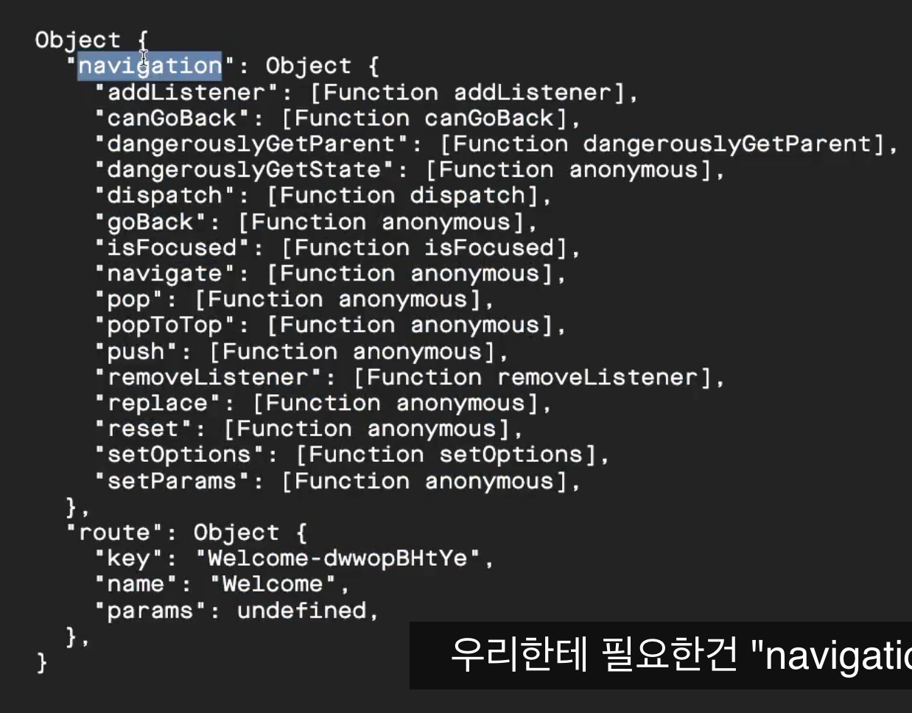

## 6.2 Preloading image

### Assets Loading and <AppLoading />

- <AppLoading />
    - document 확인
- 강의 처음부터 assets에 대해서 나온다.
  - assets이 file 타입인지, 링크 타입인지 검사해서 assets을 loading
  - assets이 file이면 expo-assets이라는 라이브러리를 이용하여 assets을 관리한다.
- prefetchImage에 대해서..
  ```js
  const cacheImage = (images) =>
    images.map((image) => {
      if (typeof image === "string") {
        return Image.prefetch(image);
      }
      // react native의 Image class를 이용하는 것이라 한다.
      else {
        return Assets.fromModule(image).downloadAsync();
      }
    });
  ```

### @expo/vetor-icons

- fontawesome icons와 비슷한거 인듯..
- npm install @expo/vector-icons
- https://icons.expo.fyi/
- 강의에서는 ionicons사용할 거라 한다.

### prefetch Font

- 뭘 계속 설치 하노..
- expo install expo-font (npm install expo-font)

```js
const cacheFonts = (fonts) => fonts.map((font) => Font.loadAsync(font));
```

- asset 로딩

# 7 REDUX SETUP

## 7.0 userSlice

- 1. Components/Gate.js 만듬.
- 2. 로그인 준비
- 3. redux toolkit 관련 라이브러리 설치
  ```sh
    npm install @reduxjs/toolkit
    npm install redux
    npm install react-redux
  ```

## redux-toolkit

- 1. createSlice 만들기
- 2. rootSlice에서 combineReducers로 rootSlice만들기
- 3. store 만들기
- 4. Provider로 store react와 연결하기.
- 5. Component에서 mapStateToProps, connect로 component 와 연결하기.
  - mapStateToProps, connect와 관련해서 코드를 줄이는 방법으로는 react-redux 라이브러리의 useSelector를 이용하는 것.
  - dispatch 사용 하려면 -> useDispatch

### redux-persist?

- redux data를 저장함으로써, 새로고침이나 추후에 다시 앱을 로딩 했을 때에도 데이터를 유지해주는 것으로 이해하면 될까?
- [링크](https://github.com/rt2zz/redux-persist)
- settings을 먼저 해줘야 한다.
  #### storage
  - setting에 보면 storage가 있는데, sotrage에는 localStorage, sessionStorage, AsyncStorage, .. 등등 많이 있음.
  - [참고](https://github.com/rt2zz/redux-persist#storage-engines)
  - localStorage - 핸드폰? 로컬? 에 저장. redux-persist/lib/storage
  - sessionStorage - redux-persist/liub/storage/session 아마도 db 세션을 말하는걸까? 아니면 유저 세션?
  - AsyncStorage - 리액트 네이티브 용

```js
  const persistedReducer = persistReducer(persistConfig, rootReducer);</code>
  const store = configureStore ( {
    reducer: persistedReducer,
    middleware: getDefaultMiddleware({
      serializableCheck: {
          ignoredActions: [FLUSH, REHYDRATE, PAUSE, PERSIST, PURGE, REGISTER]
      }
    })
  });

  const persistor = persistStore(store);
  });

```

    - 위 코드는 persistedReducer는 rootReducer가 변화가 있을 때마다 우리가 설정해 놓은 storage에 저장을 할 수 있는 오브젝트를 만드는 것.
    - 그리고 우리가 만든 store에는 rootReducer가 들어가 있는데, 이를 바꿔줘야 한다.
    - 위 middleware파트는 몰라도 되고 그냥 쓰면 된다고 하는데... 저거 없으면 에러가 나서 진행 못헌다.
      - redux toolkit과 redux persist 간에 문제? 이기 때문에 이를 무시하라는 것이라네.

    - 그다음 step으로 해줄 것.
      - App에서 설정해줄 것이 좀 있음.
      - 1. PersistGate (from redux-persist/integration/react)
        - rendering을 위해 state를 load할 때까지 기다려주는 component
        ```r
          <PersistGate loading={null} persistor={persistor}>
        ```
        - persistor는 persistStore로 만들었던 오브젝트.

### redux debug in expo

- download react native debugger fromm releases page.
- command+t or ctrl+t,
- 연결 후 ios 에서 command or ctrl + d를 눌러서 디버깅 연결.

# 8. Authentication

## 8.0 ~ 8.1 Auth navigation

### react-navigation library

- 설치 할 것이 많음.
- react navigation 홈페이지 참고해서 라이브러리들 설치.

- Start

  - navigation 폴더 만들고, Auth.js

    - createStackNavigator
    - Auth.Navigator
    - Auth.Screen.

    ```js
      <Auth.Screen name="Welcome" component={Welcome} />
      <Auth.Screen name="SignIn" component={SignIn} />
      <Auth.Screen name="SignUp" component={SignUp} />
    ```

    - 위에 있는 순서대로 먼저 화면에 나타나는 것.

  - Navigator 렌더링을 Gate에서 해주면.

        - 에러가 난다.
        - Navigator는 NavigatorContainer로 wrapping 해야 한다.

        - Navigation 관련 props
          - mode: "card", "modal" 형 있음.
          - headerMode: "float", "screen" 글자만 이동? 혹은 화면 전체 이동?
          - screenOptions: .. 문서 찾아보셈.
            - 자주 사용하는 것.
            - headerBackTitleVisible: true, false,

    

    - 중요한 props는 navigation

      - navigation.navigate(screen name) 하면 스크린으로 이동함.

    - Ionicons -> react vector icon, name, size, color
    - Platform -> react native

## 8.2 component를 만들 때
- 니코는 파일을 만드는 것보다, 폴더를 만들어서 만드는 것을 선호함.
  
### Back button component
1. styled component install
   - styled component import 할 때 "styled-components/native"로 임포트 할 것.
2. Image 컴포터넌트를 사용하였는데, pre loading한 이미지에서 가져오는 코드를 익혀놔야 할듯..
     ```js
       <Image source={require("../assets/login_splash.jpg")}/>
       <Image source={{uri: LOGO_URL}}/>
     ```
       - required 사용함.
       - resizeMethod로 이미지 크기를 조절할 수 있다. 근데 styled에서 조절하면 안되나??
         - 안됨. 없는 style옵션이라고 에러 나온다.
         - ?? 근데 resizeMethod 사용했는데도 이미지 크기 조절이 잘 안됨.
       - url을 이용하여 이미지를 불러올 때에는 아래와 같이..
         - 위와 같이 그냥 불러오면 이미지가 표시가 안되는데 그 이유는 online상의 image를 불러올 때에는 width, height를 설정을 해줘야 한다. 
3. ugly한 위 title을 고쳐보자.
   - Navigator의 Screen component에 options를 줄 수 있다. headerTitleStyle에서 변경할 수 있음.
4. status bar를 바꿔보자.
  - <StatusBar> react-native component를 이용하면 된다.
    - 강의에서는 barStyle이라 하였는데, source를 찾아 보니 style light, dark 등으로 있다.
5. Image Blur처리
   - expo 문서에서 찾아 보네.
   - expo-blur의 BlurView 컴퍼넌트임.
   - expo install 해줘야 하는 것. 
   - intensity, tint 옵션 등이 있음. 자세한 건 문서 확인.

## 8.3 Button component 만들기
1. Auth folder에서 Button을 만듬.
   - 내용 별 무.
   - Dimensions가 갑자기 튀어나옴.
     - screen 정보를 얻을 수 있는 듯함.
     - Dimensions.get("screen"). width height 를 얻어냄.
2. 일관된 컬러를 위해 color.js를 만들어 주는게 좋다함.
  
## 8.4 Sign in part one
1. Log in screen은 복잡하면 안된다고 생각한다면서 pinterest.com가서 샘플 골라서 만들자 함.
2. TextInput
   ```js
        <Container>
          <TextInput value={username} autoCapitalize="none" placeholder="Username" onChangeText={text=>setUsername(text)}></TextInput>
          <TextInput value={password} placeholder="Password" onChangeText={text=>setPassword(text)} secureTextEntry></TextInput>
          <AuthButton text={"Sing In"} accent onPress={handleSubmit}></AuthButton>
        </Container>
   ```
   - input type=text와 유사.
   - value change 관련해서 react hook과 연결 시키는 것.. 
   - 사용 props, onChangeText
   - 적을 내용이 없다 그냥 코드를 보자.
## 8.5 Keyboard avoiding view
1. Keyboard avoiding view
   >>> It is a component to solve the common problem of views that need to move out of the way of the virtual keyboard. It can automatically adjust either its height, position, or bottom padding based on the keyboard height.
  - 뭔 말인지 잘 이해는 안간다.
  - 으으 설명을 들어도 잘 모르겠다.아무튼 virtual keyboard 때문임.

## 8.6 apiClient
  
   ```js
   const callApi = async (method, path, data, jwt) => {
    const headers = {
        Authorization: jwt,
        "Content-Type": "application/json"
    }
  }
  ```
  이런 식으로 일종의 wrapper를 만든다.

## 8.7 create account
1. username을 email로 변경하였는데, input에서 keyboard appearance 바꾸는 파트가 있다.
  - keyboardType = {"email-address"}
2. Email 검증
   - email regex 이용, google에서 검색해서 사용하자.
   - utils.js 파일을 또 만드네..
   ```js
   export const isEmail = (email) => {
    const regEx = /(?:[a-z0-9!#$%&'*+/=?^_`{|}~-]+(?:\.[a-z0-9!#$%&'*+/=?^_`{|}~-]+)*|"(?:[\x01-\x08\x0b\x0c\x0e-\x1f\x21\x23-\x5b\x5d-\x7f]|\\[\x01-\x09\x0b\x0c\x0e-\x7f])*")@(?:(?:[a-z0-9](?:[a-z0-9-]*[a-z0-9])?\.)+[a-z0-9](?:[a-z0-9-]*[a-z0-9])?|\[(?:(?:25[0-5]|2[0-4][0-9]|[01]?[0-9][0-9]?)\.){3}(?:25[0-5]|2[0-4][0-9]|[01]?[0-9][0-9]?|[a-z0-9-]*[a-z0-9]:(?:[\x01-\x08\x0b\x0c\x0e-\x1f\x21-\x5a\x53-\x7f]|\\[\x01-\x09\x0b\x0c\x0e-\x7f])+)\])/;
    return regEx.test(email);
  }
   ```
  - 정규식을 이렇게 사용해 볼 수 있구나.
3. axios return value에서 status 속성으로 결과를 알 수 있음.
4. 